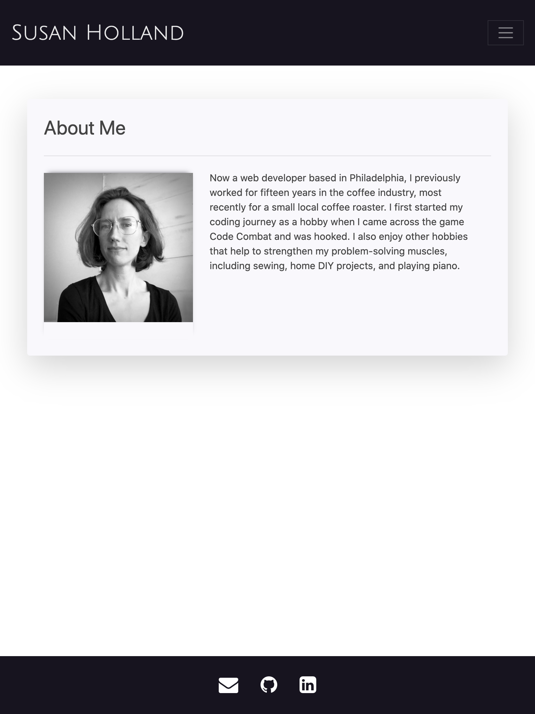
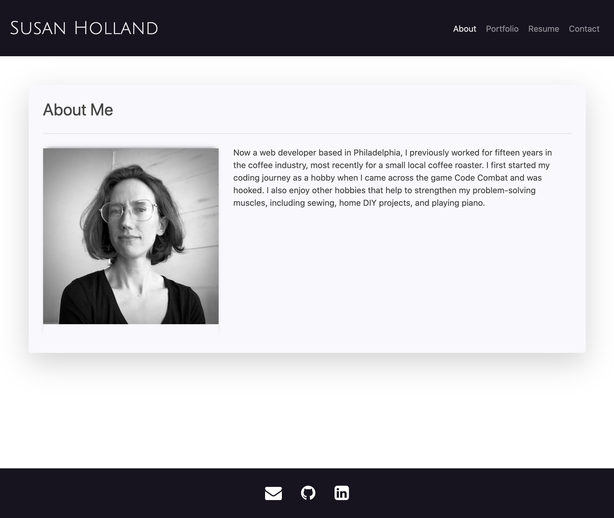

# MyPortfolio
* [Deployed Site](https://segh.github.io)
* [My GitHub](https://github.com/SEGH)

## Description
This is my portfolio page to showcase projects I've worked on throughout my coding education. It will continue to evolve as I learn and make content. The page itself started as a practice in building a responsive website relying on Bootstrap. To challenge myself to learn as much of the utilities and components that Bootstrap has to offer, I began without my own additional external stylesheet linked and focused on the layout and responsive aspects. In the most recent update, I used a Bootswatch theme, Google Fonts, as well as some custom box shadows in a css stylesheet to add some additional styling. Content added includes screenshots and links to three projects and a downloadable pdf of my resume.

## Screenshots
Some examples of how the site behaves at different breakpoints.
### 375px

### 768px

### 1025px
