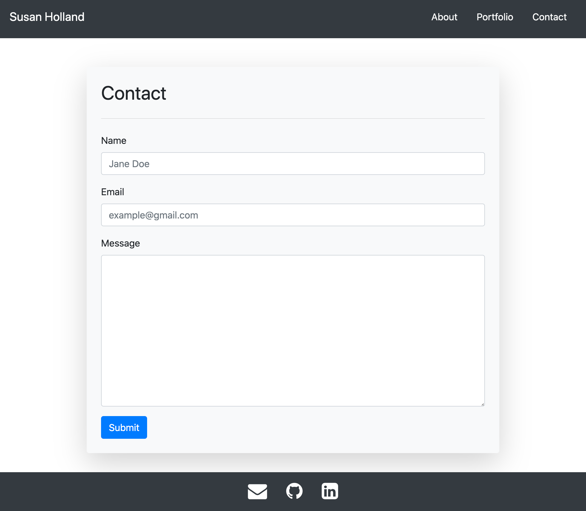

# MyPortfolio
* [Deployed Site](https://segh.github.io)
* [My GitHub](https://github.com/SEGH)
## Description
This is my portfolio page to showcase projects I've worked on throughout my coding education. It will continue to evolve as I learn and make content. The page itself is starting as a practice in building a responsive website relying on Bootstrap. To challenge myself to learn as much of the utilities and components that Bootstrap has to offer, I am beginning without my own additional external stylesheet linked and focusing on the layout and responsive aspects. As it evolves, I plan to add additional aesthetic design such as fonts and colors.
## Screenshots
Some examples of how the site behaves at different breakpoints.
### 640px

### 768px

### 980px

